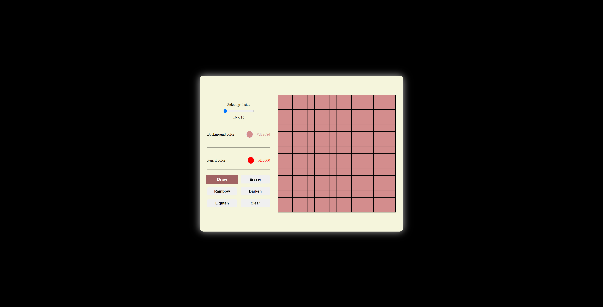

Over the past few days, I've been working on a project that mimics the classic Etch A Sketch game. In this version, you can adjust the grid size and paint directly onto a canvas. The interface lets you customize both the background color and the pen color. In terms of functionalities, there are several buttons: one for drawing, another that serves as an eraser—essentially repainting tiles to the background color—a 'Rainbow' button that randomizes pen colors, and options to darken or lighten the tiles by 10%. There's also a 'Clear' button to wipe the canvas clean. The primary focus of this project was to hone my JavaScript and DOM manipulation skills, so I didn't dwell too much on the CSS aspects.

One issue I've encountered is that sometimes the tiles behave as if they're draggable, refusing to take on color. Despite setting the 'draggable' attribute to 'false,' the problem persists and I'm not sure how to resolve it.

I had a blast working on this project, and I hope you have just as much fun trying it.

You can find the deployed project here:
[Etch a Sketch](https://aesthetic-boba-d0e0a9.netlify.app/)

screenshot of the project:

